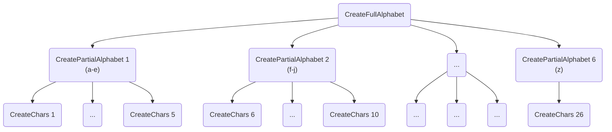

# Example: Sequential HTCondor workflows at CERN

This example demonstrates how to create sequential law task workflows that run on the HTCondor batch system at CERN.

The actual payload of the tasks is rather trivial, however, the way the jobs are eagerly submitted
in a sequential fashion is a bit more advanced.
If you haven't done so already, go through the [htcondor_at_cern](../htcondor_at_cern) example first for a more streamlined version of the same payload.

The main idea of the task structure below is the following. Oftentimes, a sophisticated workflow might consist of several stages of jobs to process, where the result of jobs *A* is required by some jobs *B*.
In some cases, it may happen that some jobs in *A* take significantly longer than others, resulting in a potentially unwanted delay, whereas some jobs on *B* could probably already be submitted.
This *eager* job submission scenario can be easily modelled with law workflows as demonstrated below with a trivial payload.

A workflow that submits jobs via HTCondor (*A* in the analogy above) consists of 26 tasks which convert an integer between 97 and 122 (ascii) into a character.
A second workflow (*B*) collects results of five of the previous tasks (run within remote jobs) and concatenates them into partial alphabet chunks, **again run in remote jobs**.
A single, final task collects the partial results in the end and writes all characters into a text file, now consisting of the full alphabet.

The dependency structure is visualized in the following graph.



As soon as a single `CreateChars` chunk (of five) workflow is finished, a dedicated `CreatePartialAlphabet` can be triggered that eagerly submits new jobs while some of the `CreateChars` might potentially still run.

Resources: [luigi](http://luigi.readthedocs.io/en/stable), [law](http://law.readthedocs.io/en/latest)

#### 0. At CERN: copy this example to your user space

```shell
mkdir -p /examplepath
cd /examplepath
cp -r /afs/cern.ch/user/m/mrieger/public/law_sw/law/examples/sequential_htcondor_at_cern/* .
```

#### 1. Source the setup script (just software and some variables)

```shell
source setup.sh
```

#### 2. Let law index your tasks and their parameters (for autocompletion)

```shell
law index --verbose
```

You should see:

```shell
indexing tasks in 1 module(s)
loading module 'analysis.tasks', done

module 'analysis.tasks', 3 task(s):
    - CreateChars
    - CreatePartialAlphabet
    - CreateFullAlphabet

written 3 task(s) to index file '/examplepath/.law/index'
```

#### 3. Check the status a `CreatePartialAlphabet` task

Here, we have two choices.
We can either print the status of a single `CreatePartialAlphabet` branch (shown first), or we can
print the status of a `CreatePartialAlphabet` workflow that only consists of one branch.
Note the subtle but decisive difference between `--branch` and `--branches`.

First with `--branch 0`:

```shell
> law run CreatePartialAlphabet --version v1 --branch 0 --print-status -1

print task status with max_depth -1 and target_depth 0

0 > CreatePartialAlphabet(workflow=htcondor, branch=0, version=v1)
│     LocalFileTarget(fs=local_fs, path=/examplepath/data/CreatePartialAlphabet/v1/alphabet_part0.txt)
│       absent
│
├──1 > CreateChars(workflow=htcondor, branch=0, version=v1)
│        LocalFileTarget(fs=local_fs, path=/examplepath/data/CreateChars/v1/output_0.json)
│          absent
│
├──1 > CreateChars(workflow=htcondor, branch=1, version=v1)
│        LocalFileTarget(fs=local_fs, path=/examplepath/data/CreateChars/v1/output_1.json)
│          absent
│
├──1 > CreateChars(workflow=htcondor, branch=2, version=v1)
│        LocalFileTarget(fs=local_fs, path=/examplepath/data/CreateChars/v1/output_2.json)
│          absent
│
├──1 > CreateChars(workflow=htcondor, branch=3, version=v1)
│        LocalFileTarget(fs=local_fs, path=/examplepath/data/CreateChars/v1/output_3.json)
│          absent
│
└──1 > CreateChars(workflow=htcondor, branch=4, version=v1)
         LocalFileTarget(fs=local_fs, path=/examplepath/data/CreateChars/v1/output_4.json)
           absent
```

And again with `--branches 0` (choosing a workflow containing only the first branch):

```shell
> law run CreatePartialAlphabet --version v1 --branches 0 --print-status -1

print task status with max_depth -1 and target_depth 0

0 > CreatePartialAlphabet(workflow=htcondor, branch=-1, branches=0, version=v1)
│     submission: LocalFileTarget(fs=local_fs, path=/examplepath/data/CreatePartialAlphabet/v1/htcondor_submission_0.json, optional)
│       absent
│     status: LocalFileTarget(fs=local_fs, path=/examplepath/data/CreatePartialAlphabet/v1/htcondor_status_0.json, optional)
│       absent
│     collection: TargetCollection(len=1, threshold=1.0)
│       absent (0/1)
│
└──1 > CreateChars(workflow=htcondor, branch=-1, branches=0:5, version=v1)
         submission: LocalFileTarget(fs=local_fs, path=/examplepath/data/CreateChars/v1/htcondor_submission_0To6.json, optional)
           absent
         status: LocalFileTarget(fs=local_fs, path=/examplepath/data/CreateChars/v1/htcondor_status_0To6.json, optional)
           absent
         collection: TargetCollection(len=5, threshold=5.0)
           absent (0/5)
```

In any case, no tasks ran so far, so no output target should exist yet.

#### 4. Check the status of the `CreateFullAlphabet` task

This task triggers the six `CreatePartialAlphabet` tasks which in turn require all 26 `CreateChars` tasks.
For better visibility, we can limit the depth by choosing `--print-status 1` instead of `-1`.

```shell
> law run CreateFullAlphabet --version v1 --print-status 1

print task status with max_depth 1 and target_depth 0

0 > CreateFullAlphabet(version=v1)
│     LocalFileTarget(fs=local_fs, path=/examplepath/data/CreateFullAlphabet/v1/full_alphabet.txt)
│       absent
│
├──1 > CreatePartialAlphabet(workflow=htcondor, branch=-1, branches=0, version=v1)
│        submission: LocalFileTarget(fs=local_fs, path=/examplepath/data/CreatePartialAlphabet/v1/htcondor_submission_0.json, optional)
│          absent
│        status: LocalFileTarget(fs=local_fs, path=/examplepath/data/CreatePartialAlphabet/v1/htcondor_status_0.json, optional)
│          absent
│        collection: TargetCollection(len=1, threshold=1.0)
│          absent (0/1)
│
├──1 > CreatePartialAlphabet(workflow=htcondor, branch=-1, branches=1, version=v1)
│        submission: LocalFileTarget(fs=local_fs, path=/examplepath/data/CreatePartialAlphabet/v1/htcondor_submission_1.json, optional)
│          absent
│        status: LocalFileTarget(fs=local_fs, path=/examplepath/data/CreatePartialAlphabet/v1/htcondor_status_1.json, optional)
│          absent
│        collection: TargetCollection(len=1, threshold=1.0)
│          absent (0/1)
│
├──1 > CreatePartialAlphabet(workflow=htcondor, branch=-1, branches=2, version=v1)
│        submission: LocalFileTarget(fs=local_fs, path=/examplepath/data/CreatePartialAlphabet/v1/htcondor_submission_2.json, optional)
│          absent
│        status: LocalFileTarget(fs=local_fs, path=/examplepath/data/CreatePartialAlphabet/v1/htcondor_status_2.json, optional)
│          absent
│        collection: TargetCollection(len=1, threshold=1.0)
│          absent (0/1)
│
├──1 > CreatePartialAlphabet(workflow=htcondor, branch=-1, branches=3, version=v1)
│        submission: LocalFileTarget(fs=local_fs, path=/examplepath/data/CreatePartialAlphabet/v1/htcondor_submission_3.json, optional)
│          absent
│        status: LocalFileTarget(fs=local_fs, path=/examplepath/data/CreatePartialAlphabet/v1/htcondor_status_3.json, optional)
│          absent
│        collection: TargetCollection(len=1, threshold=1.0)
│          absent (0/1)
│
├──1 > CreatePartialAlphabet(workflow=htcondor, branch=-1, branches=4, version=v1)
│        submission: LocalFileTarget(fs=local_fs, path=/examplepath/data/CreatePartialAlphabet/v1/htcondor_submission_4.json, optional)
│          absent
│        status: LocalFileTarget(fs=local_fs, path=/examplepath/data/CreatePartialAlphabet/v1/htcondor_status_4.json, optional)
│          absent
│        collection: TargetCollection(len=1, threshold=1.0)
│          absent (0/1)
│
└──1 > CreatePartialAlphabet(workflow=htcondor, branch=-1, branches=5, version=v1)
         submission: LocalFileTarget(fs=local_fs, path=/examplepath/data/CreatePartialAlphabet/v1/htcondor_submission_5.json, optional)
           absent
         status: LocalFileTarget(fs=local_fs, path=/examplepath/data/CreatePartialAlphabet/v1/htcondor_status_5.json, optional)
           absent
         collection: TargetCollection(len=1, threshold=1.0)
           absent (0/1)
```

As you can see, there is a total of six tasks required (`ceil(26 / 5)`).

#### 5. Run the `CreateFullAlphabet` task

As we want to see the eager submission structure in action, we pick six six parallel processes to run (``--workers 6``) which allows starting the six `CreatePartialAlphabet` tasks (that only perform job status polling on your local machine) with maximum concurrency.

```shell
law run CreateFullAlphabet --version v1 --workers 6
```

This should take only a few minutes to process, depending on the job queue availability.
You will notice that as soon as the first `CreateChars` workflow (with five branches each) successfully finishes, a `CreatePartialAlphabet` workflow (with a single branch) is started, that submits a job.
In the end, the full alphabet should be written to the command line as well as to the output of `CreateFullAlphabet`.

By default, this example uses a local scheduler, which - by definition - offers no visualization tools in the browser.
If you want to see how the task tree is built and subsequently run, run ``luigid`` in a second terminal.
This will start a central scheduler at *localhost:8082* (the default address).
To inform tasks (or rather *workers*) about the scheduler, either add ``--local-scheduler False`` to the ``law run`` command, or set the ``local-scheduler`` value in the ``[luigi_core]`` config section in the ``law.cfg`` file to ``False``.

#### 6. Look at the results

```shell
cd data
ls */v1/
```

#### 7. Cleanup the results

```shell
law run CreateFullAlphabet --version v1 --remove-output -1
```
