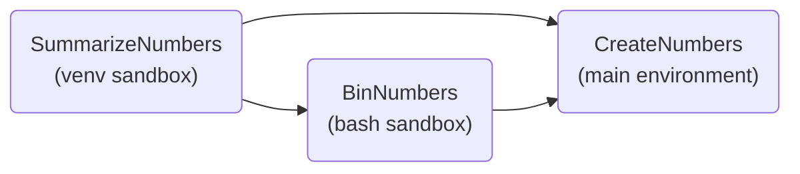

# Example: Sandboxing via subshells

This example demonstrates how to run tasks in different software environments using the two subshell-based types of [sandboxing](https://law.readthedocs.io/en/latest/sandboxing.html), bash and venv sandboxes.

The tasks are defined in [tasks.py](tasks.py):

- `CreateNumbers` runs in the main environment and writes gaussian distributed random numbers into a text file.
- `BinNumbers` histograms them inside a **bash sandbox** (`bash::$SUBSHELLEXAMPLE_PATH/sandbox_bash.sh`), which sources the [sandbox_bash.sh](sandbox_bash.sh) setup script in a subshell before the task runs.
  The script exports a variable that only exists inside the sandbox.
- `SummarizeNumbers` computes statistics with numpy inside a **venv sandbox** (`venv::$SUBSHELLEXAMPLE_PATH/tmp/venv_numpy`), which activates a dedicated virtual environment.
  numpy is not installed in the main environment, so it is imported within `run()` and not at the top of the module.



Unlike containers, subshells inherit the environment of the outer process.
Therefore, variables such as `DATA_PATH` and the `PYTHONPATH` that makes the tasks importable are available inside the sandboxes without further configuration, and inputs and outputs are reachable at the same paths.
Compare this to the [docker_sandboxes](../docker_sandboxes) and [singularity_sandboxes](../singularity_sandboxes) examples, which need to mount the example directory and forward variables explicitly.

Resources: [luigi](https://luigi.readthedocs.io/en/stable), [law](https://law.readthedocs.io/en/latest), [numpy](https://numpy.org)

## 1. Source the setup script

```shell
source setup.sh
```

On first use, this creates two virtual environments:

- `tmp/venv` with law, used as the main environment (except when running in the `riga/law:example` docker image),
- `tmp/venv_numpy` with law and numpy, used by the venv sandbox.

Note that law must be installed in the venv sandbox as well, since the sandboxed task is executed via `law run` inside it.

## 2. Let law index your tasks and their parameters (for autocompletion)

```shell
law index --verbose
```

You should see:

```shell
indexing tasks in 1 module(s)
loading module 'tasks', done

module 'tasks', 3 task(s):
    - CreateNumbers
    - BinNumbers
    - SummarizeNumbers

written 3 task(s) to index file '/examplepath/.law/index'
```

## 3. Run the `SummarizeNumbers` task

```shell
law run SummarizeNumbers
```

Among the output, you will see the messages of the sandboxed tasks, framed by "entering sandbox" and "leaving sandbox" banners:

```shell
running in sandbox 'bash::$SUBSHELLEXAMPLE_PATH/sandbox_bash.sh' with binning mode 'uniform'
...
running in sandbox 'venv::$SUBSHELLEXAMPLE_PATH/tmp/venv_numpy' with numpy 2.5.3
count: 1000
mean: 0.5050908965241948
std: 0.15338446011000384
median: 0.5049151862848131
fullest_bin: 4
```

Your numbers will differ slightly since they are random.

## 4. Check the status

```shell
law run SummarizeNumbers --print-status -1
```

Requirements and outputs of sandboxed tasks are evaluated in the main environment, just like for any other task:

```shell
print task status with max_depth -1 and target_depth 0

0 > SummarizeNumbers(n_nums=1000)
│     LocalFileTarget(fs=local_fs, path=$DATA_PATH/summary_1000.json)
│       existent
│
├──1 > CreateNumbers(n_nums=1000)
│        LocalFileTarget(fs=local_fs, path=$DATA_PATH/numbers_1000.txt)
│          existent
│
└──1 > BinNumbers(n_nums=1000, n_bins=10)
   │     LocalFileTarget(fs=local_fs, path=$DATA_PATH/binned_1000_10.json)
   │       existent
   │
   └──2 > CreateNumbers(n_nums=1000)
            LocalFileTarget(fs=local_fs, path=$DATA_PATH/numbers_1000.txt)
              existent
```

## 5. Look at the results

```shell
ls data
cat data/summary_1000.json
```

## 6. Cleanup the results

```shell
law run SummarizeNumbers --remove-output -1
```
